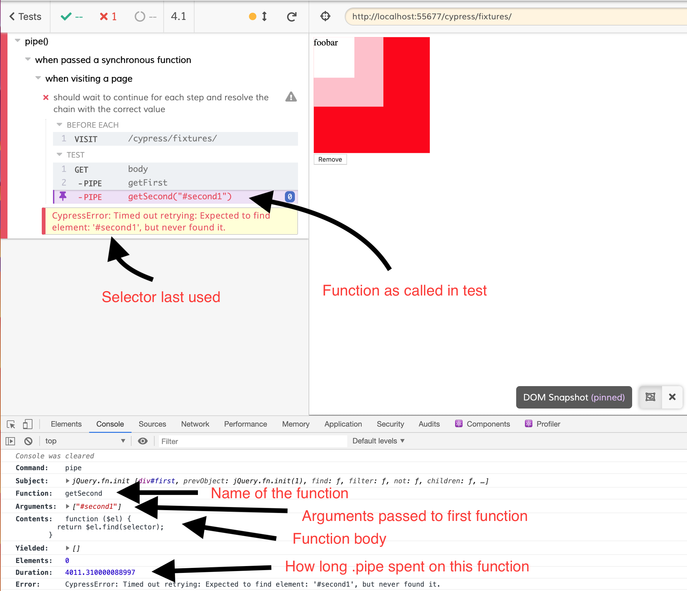

# Cypress Pipe
`cy.pipe` can be used as a simpler replacement for Cypress Custom Commands - you just write functions.

`cy.pipe` works very similarly to `cy.then` except for a few key differences:
* `pipe` will try to document the function name in the Command log (only works on named functions)
* `pipe` will create DOM snapshots to aid in debugging
* If the function passed to `pipe` resolves synchronously (doesn't contain Cypress commands)
  - AND returns a jQuery element, `pipe` will retry until the jQuery element list is not empty (most Cypress commands do this)
  - AND is followed by a `cy.should`, the function will be retried until the assertion passes or times out (most Cypress commands do this)

```ts
const obj = { foo: 'bar' }
const getFoo = s => s.foo
setTimeout(() => { obj.foo = 'baz' }, 1000)

cy.wrap(obj)
  .pipe(getFoo)
  .should('equal', 'baz')
```

The above assertion will pass after 1 second. The Cypress Command Log will look like:

```
WRAP       {foo: bar}
 - PIPE    getFoo
 - ASSERT  expected bar to equal bar
```

If the `pipe` was using a `then`, it would fail immediately and wouldn't show the `getFoo` functions anywhere in the Cypress Command Log.

If you care even more about log output and you have more generic functions that curry other functions, you can use `loggable`. That sounds scary, but you might have a function like `getTodoByName` where the function takes the name of the Todo and returns a function that takes a container. For example:

```ts
import { loggable } from 'cypress-pipe'

const getProp = loggable('getProp', prop => obj => obj[prop])
// alternative
const getProp = loggable(prop => function getProp(obj) { return obj[prop] })

cy.wrap({ foo: 'bar' })
  .pipe(getProp('foo'))
  .should('equal', 'bar')
```

The `loggable` decorator function can either take a `name` as a string, or allow `.pipe` to get it from a named currried function.

The Cypress Log will look like:

```
WRAP       {foo: bar}
 - PIPE    getProp("foo")
 - ASSERT  expected bar to equal bar
```


This library is a proof of concept, but should be stable. The proposal can be found here: https://github.com/cypress-io/cypress/issues/1548

## Best Practices

### Use synchronous functions when possible
Synchronous functions can be retried, async functions cannot. Retrying allows implicit waiting which avoids confusing flaky failures where tests are dependant on timing.

```ts
// bad
// The `cy.*` command inside the function prevents automatic retries. The following will actually fail if the text `'foobar'` isn't immediately available in the DOM
const getFirst = $el => cy.wrap($el).find('#first')

cy.get('body')
  .pipe(getFirst)
  .should('contain', 'foobar')

// good
// synchronous resolution - pipe will retry `getFirst` until it returns a non-empty jQuery element list and contains the text 'foobar'
const getFirst = $el => $el.find('#first')

cy.get('body')
  .pipe(getFirst)
  .should('contain', 'foobar')
```

### Use cy commands for actions
`pipe` detects the use of Cypress commands and assumes side effects. It will take a 'before' and 'after' snapshots. 'before' is taken before any code is run. 'after' is taken at the end after the function is complete. For action helpers, this makes for a nice before/after snapshots. `pipe` doesn't prevent logging of Cypress commands from within a function (which can be confusing). If Cypress supports [Command Log Grouping](https://github.com/cypress-io/cypress/issues/1260), `pipe` could invoke to have perfect logging.

```ts
const submitForm = $el => cy.wrap($el).find('#submit').click()

cy.get('form')
  .pipe(submitForm) // has before/after of submitting form

// Command Log:
// GET        <form>
//  -PIPE     submitForm
//  -WRAP     <form>
//  -FIND     #submit
//  -CLICK
```

### Name functions
Don't use anonymous functions and pick short and descriptive function names. The Command Log can be used as a tool for mapping the contents of a test to the screenshot/video. This is useful when finding out which step the test failed on.

```ts
// okay
cy.wrap({ foo: 'bar' })
  .pipe(s => s.foo)
  .should('equal', 'bar')

// Command Log:
// WRAP       {foo: bar}
//  -PIPE     function() {}
//  - ASSERT  expected 'bar' to equal 'bar'

// good
const getFoo = s => s.foo
cy.wrap({ foo: 'bar' })
  .pipe(getFoo)
  .should('equal', 'bar')

// Command Log:
// WRAP       {foo: bar}
//  -PIPE     getFoo
//  - ASSERT  expected 'bar' to equal 'bar'
```

If you have a function that returns another function (curried for extra input), name that.
```ts
// Name the returned curried function
const getProp = key => function getProp(s) {
  return s[key]
}

cy.wrap({ foo: 'bar' })
  .pipe(getProp('foo'))
  .should('equal', 'bar')

// Command Log:
// WRAP       {foo: bar}
//  -PIPE     getProp
//  - ASSERT  expected 'bar' to equal 'bar'
```

Here's a screenshot of a failure using `cypress-pipe` and `loggable`:



The code that produced this was:

```ts
const getFirst = $el => $el.find('#first')
const getSecond = loggable('getSecond', selector => $el => $el.find(selector))

cy.get('body')
  .pipe(getFirst)
  .pipe(getSecond('#second1'))
  .should('contain', 'foobar')
```

Pipe tries to add as much debugging information as possible.


## Installation
```
npm install cypress-pipe -D
```

Add the following to your `cypress/support/index` file:

```ts
import 'cypress-pipe'
```

